# 🚗 Motors - Plataforma de Venda de Veículos

Sistema web desenvolvido com Laravel e Breeze para gerenciamento e venda de veículos, oferecendo uma interface completa tanto para clientes quanto para administradores.

## 📋 Sobre o Projeto

O Motors é uma plataforma completa de venda de carros que permite:
- Navegação e busca de veículos por marca
- Sistema de autenticação e recuperação de senha
- Painel administrativo para gerenciamento de veículos
- Perfil de usuário personalizável

## 🛠️ Tecnologias Utilizadas

- **Laravel** - Framework PHP
- **Laravel Breeze** - Autenticação e scaffolding
- **Blade** - Template engine
- **MySQL** - Banco de dados
- **Node.js** - Gerenciamento de dependências frontend

## 📦 Pré-requisitos

Antes de começar, certifique-se de ter instalado:

- [PHP](https://www.php.net/downloads.php) (versão 8.1 ou superior)
- [Composer](https://getcomposer.org/download/)
- [Node.js](https://nodejs.org/pt/download) (versão 16 ou superior)
- MySQL ou outro banco de dados compatível

## 🚀 Instalação

### Passo 1: Criar o Projeto Laravel

```bash
composer create-project laravel/laravel Motors
cd Motors
```

### Passo 2: Instalar Laravel Breeze

```bash
composer require laravel/breeze --dev
php artisan breeze:install blade
```

### Passo 3: Instalar Dependências Frontend

```bash
npm install
```

### Passo 4: Configurar o Banco de Dados

1. Copie o arquivo `.env.example` para `.env`:
```bash
cp .env.example .env
```

2. Configure as credenciais do banco de dados no arquivo `.env`

3. Execute as migrações e seeders:
```bash
php artisan migrate --seed
```

**Nota:** Alternativamente, você pode executar os comandos SQL do arquivo `insert` manualmente.

### Passo 5: Substituir Arquivos do Projeto

Substitua as seguintes pastas e arquivos pelos arquivos fornecidos na pasta `Motors`:

- `app/`
- `resources/`
- `routes/`
- `database/`
- `public/`
- `.env`

### Passo 6: Iniciar os Servidores

Execute os seguintes comandos em terminais separados:

**Terminal 1 - Servidor Laravel:**
```bash
php artisan serve
```

**Terminal 2 - Servidor de Desenvolvimento Frontend:**
```bash
npm run dev
```

Acesse o sistema em: `http://localhost:8000`

## 🎯 Funcionalidades

### Para Usuários
- ✅ Visualização de catálogo de veículos
- ✅ Busca e filtro por marca
- ✅ Detalhes do veículo
- ✅ Cadastro e login
- ✅ Recuperação de senha por e-mail
- ✅ Edição de perfil

### Para Administradores
- ✅ Painel administrativo
- ✅ Cadastro de novos veículos
- ✅ Listagem de todos os veículos
- ✅ Edição de veículos
- ✅ Exclusão de veículos
- ✅ Gerenciamento de usuários

## 📸 Galeria de Screenshots

### Interface Principal

#### Menu e Navegação


#### Visualização de Produto
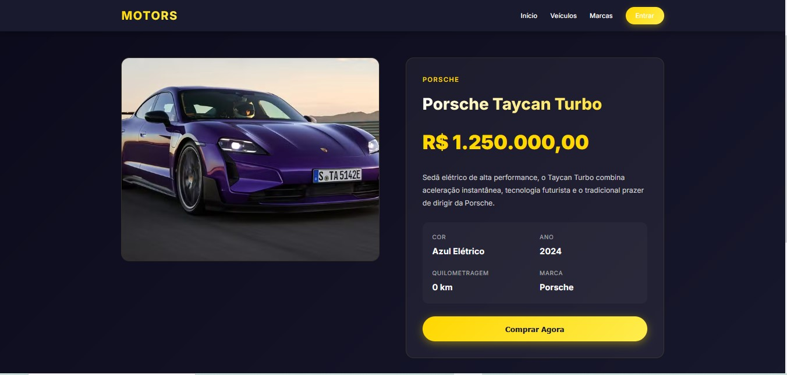

#### Filtros
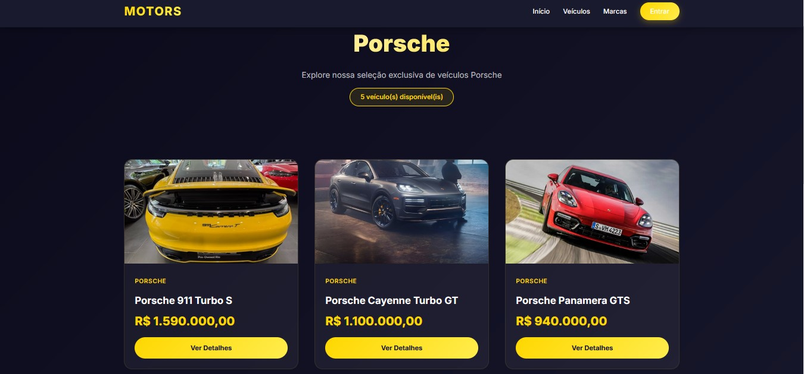

### Autenticação

#### Login
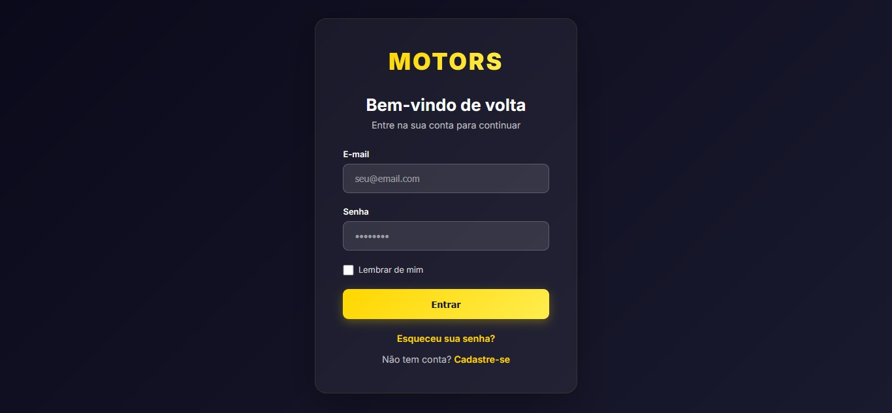

#### Recuperação de Senha
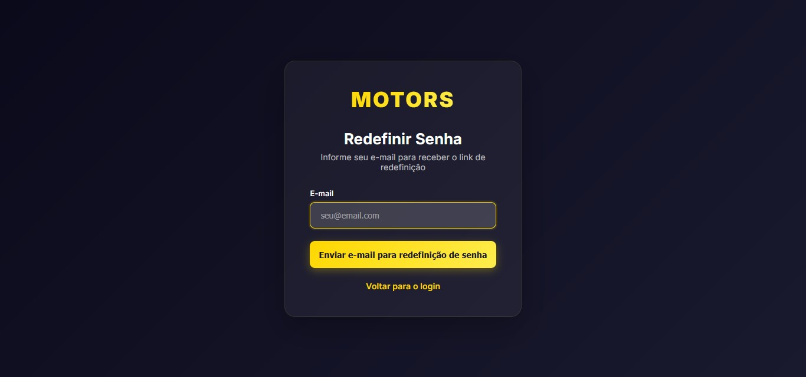

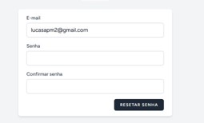
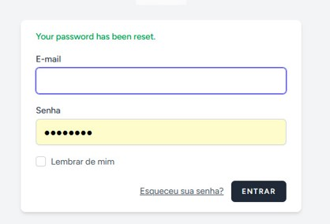

#### Cadastro
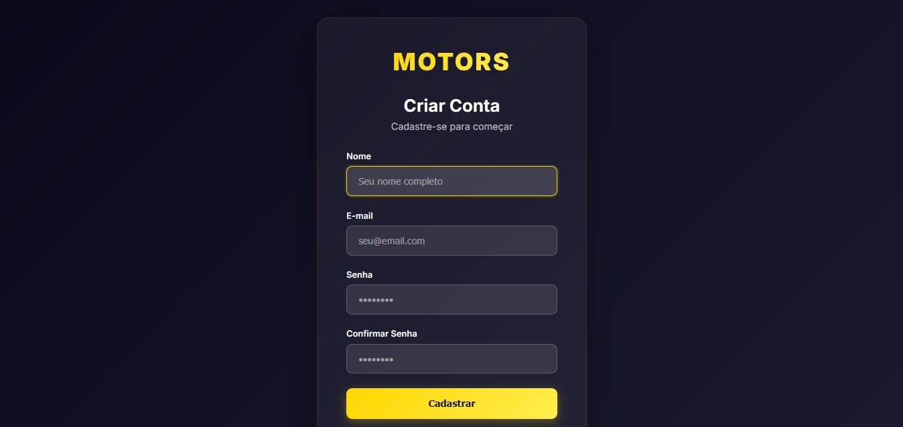

### Painel Administrativo

#### Dashboard
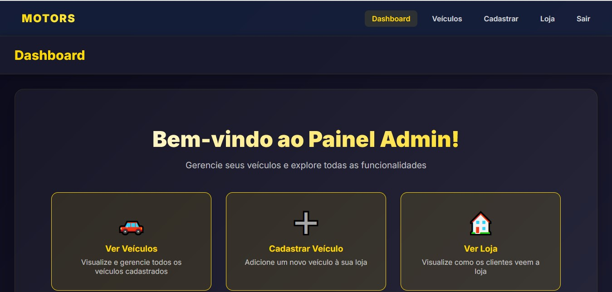

#### Gerenciamento de Veículos
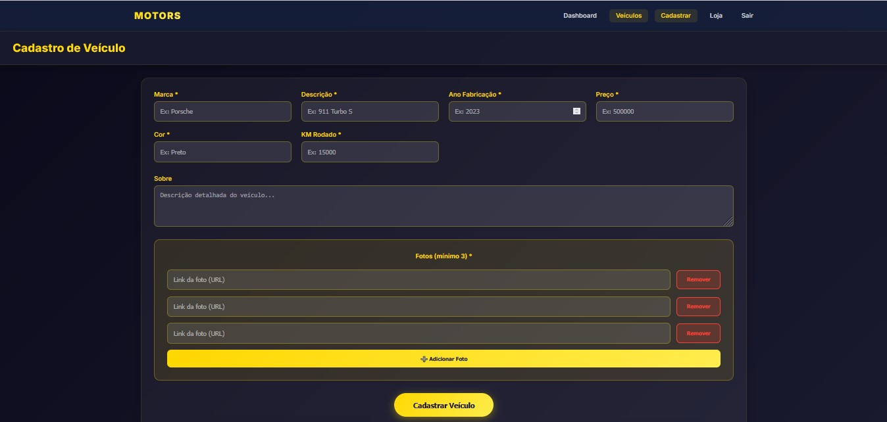
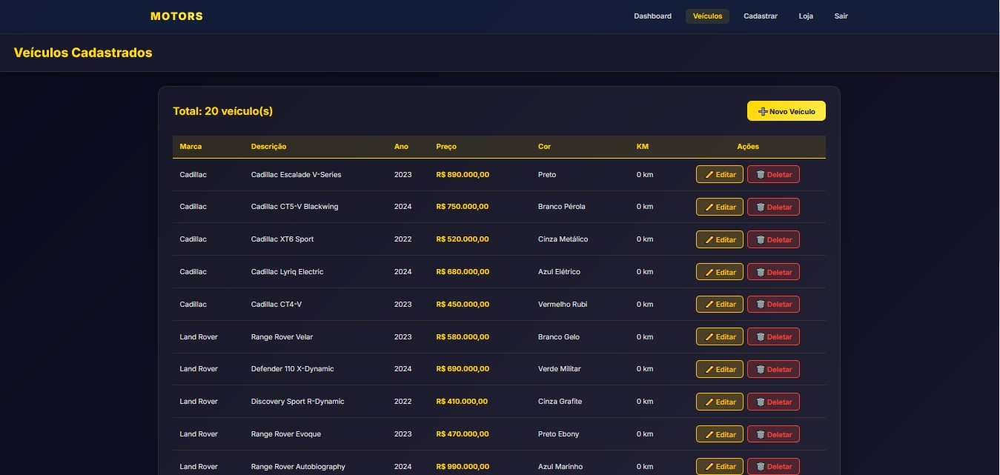
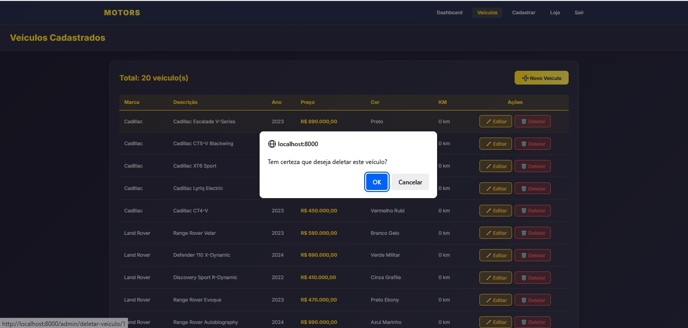
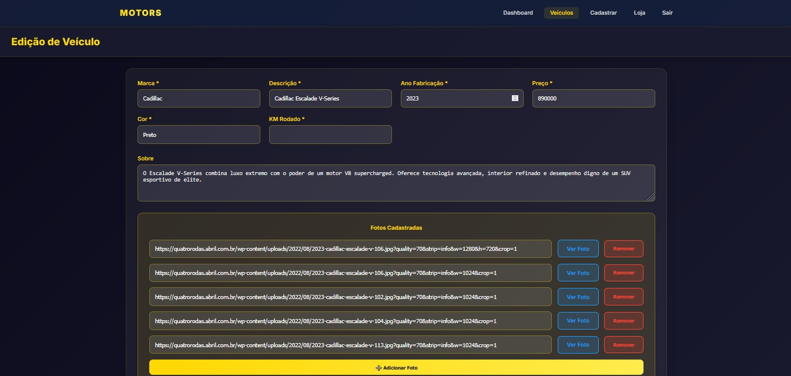

### Perfil do Usuário

#### Configurações

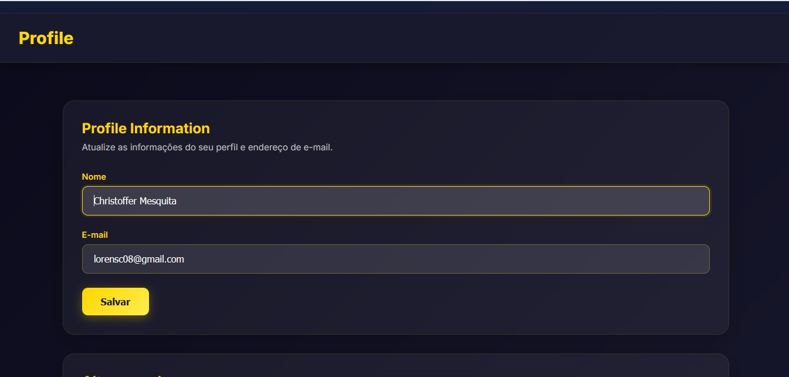
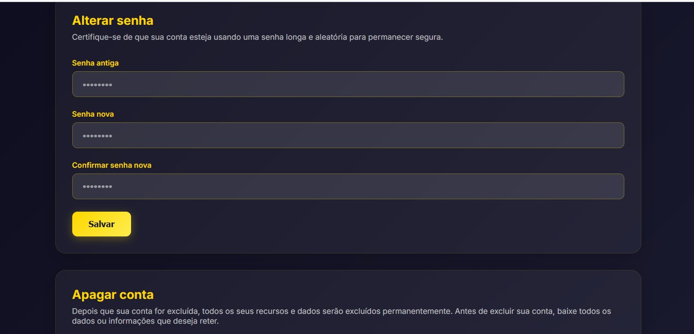

## 📝 Estrutura do Projeto

```
Motors/
├── app/              # Lógica da aplicação
├── resources/        # Views e assets
├── routes/           # Rotas da aplicação
├── database/         # Migrações e seeders
├── public/           # Arquivos públicos
└── .env             # Configurações do ambiente
```

## 🤝 Contribuindo

Este é um projeto acadêmico. Para contribuições, por favor abra uma issue ou pull request.

## 📄 Licença

Este projeto é de uso educacional.

---

**Desenvolvido com ❤️ usando Laravel e Breeze**
